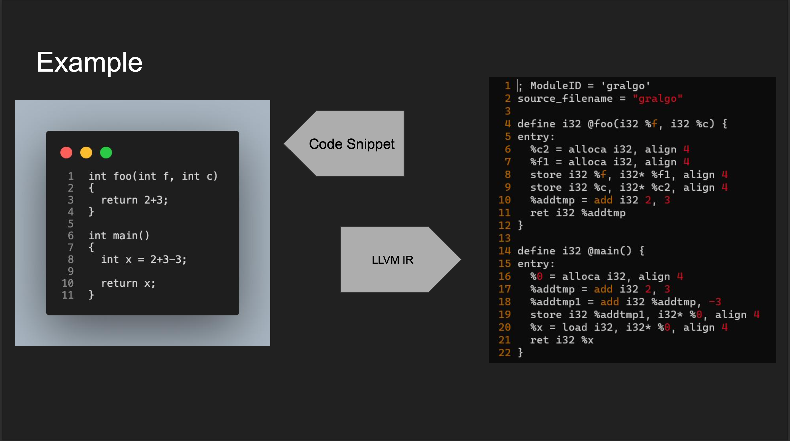

# `GrAlgo`

**GrAlgo** is a **Domain Specific Language** in which we aim to bring the user closer to the **Graph Data Structure** which is not available in
the general STL library for C++.

Our programming language intuitively uses inbuilt functions and inbuilt data types
which makes GrAlgo a powerful tool. Using our language the user can easily define different types of
graphs and also traverse using Breadth-First and Depth-First methods using our inbuilt functions we
also provide a wide range of methods to represent graphs such as **Node List**, **Edge List** along with
the normal usage.

### `Table of Contents`

| SNo. | **Contents**                                                                                                                                 |
| ---- | -------------------------------------------------------------------------------------------------------------------------------------------- |
| 1.   | [About](#about)                                                                                                                              |
| 2.   | [Features](#features)                                                                                                                        |
| 3.   | [Screenshots](#screenshots)                                                                                                                  |
| 4.   | [Installation](#installation)                                                                                                                |
| 4.   | [Lexer](https://github.com/IITH-COMPILERS2/compilers-2-project-team-5-aug22/tree/main/Lexer/readme.md)                                       |
| 4.   | [Parser](https://github.com/IITH-COMPILERS2/compilers-2-project-team-5-aug22/tree/main/Parser/README.md)                                     |
| 4.   | [Semantic and Code Generation](https://github.com/IITH-COMPILERS2/compilers-2-project-team-5-aug22/tree/main/Semantic_and_CodeGen/README.md) |
| 5.   | [References For Development](#references-for-development)                                                                                    |

---

# `About`

This language **Gralgo** is mainly created for the user to use the Graph Algorithms directly without writing the implementation for Graphs and all the Functions from scratch for each code.

---

# `Features`

In this Language, we can use functions for **Traversal** like
**BFS** , **DFS** , **Cycle Detection** , **Shortest Path Algorithms** like **Dijkstra's Algorithm**  etc.

<!-- Add Final Report Link After Adding Final Report to Github -->

For Proper usage Details, Refer [Final Report](https://github.com/IITH-COMPILERS2/compilers-2-project-team-5-aug22/tree/main/Final_Report).

---

# `Screenshots`

# 1. Lexer Code Example

   

# 2. Parser Code Example

   

# 3. Semantic Code Example

   

# 4. Code Generation Example

   

---

# `Installation`

To build the compiler, the prerequisite softwares are

```code
flex
bison
gcc
clang++
llvm-suite
make
```

The above softwares can be installed by the following command

```bash
sudo apt install build-essential

sudo apt-get install flex bison clang-format clang-tidy clang-tools clang clangd libc++-dev libc++1 libc++abi-dev libc++abi1 libclang-dev libclang1 liblldb-dev libllvm-ocaml-dev libomp-dev libomp5 lld lldb llvm-dev llvm-runtime llvm python3-clang
```

Now, to build the compiler, we have to go to the Semantics_and_CodeGen folder and run the command

```bash
make
```

Now, we have build the compiler, to compile a program, write the code in `input.gr` and run the command

```bash
make test
```

To run the command, we have to use the command

```bash
./a.out
```

---

# `References for development`

- [Flex](https://github.com/IITH-COMPILERS2/compilers-2-project-team-5-aug22/blob/main/Resources/flex.pdf)
- [Bison](https://github.com/IITH-COMPILERS2/compilers-2-project-team-5-aug22/blob/main/Resources/bison.pdf)
- [O'Reilly](https://github.com/jmparis/flex-bison-oreilly)
- [Flex Bison Cpp Example](https://github.com/ezaquarii/bison-flex-cpp-example)
- [LLVM Kaleidoscope](https://llvm.org/docs/index.html)

---

# `Contributors`

- [Umesh Kalvakuntla](https://www.github.com/Umesh-k26) CS20BTECH11024
- [Muttareddy Sahil Chandra](https://github.com/SAHIL150602) CS20BTECH11033
- [Polneni Ganesh Nikhil Madhav](https://github.com/Nik123-cpp) CS20BTECH11036
- [Gorantla Pranav Sai](https://github.com/pranav-159) CS20BTECH11018
- [Vanga Aravind Shounik](https://github.com/AravindShounik) CS20BTECH11055
- [Suraj Telugu](https://github.com/SurajTelugu) CS20BTECH11050
- [Adepu Vasisht](https://github.com/Vasishtadepu) CS20BTECH11002
